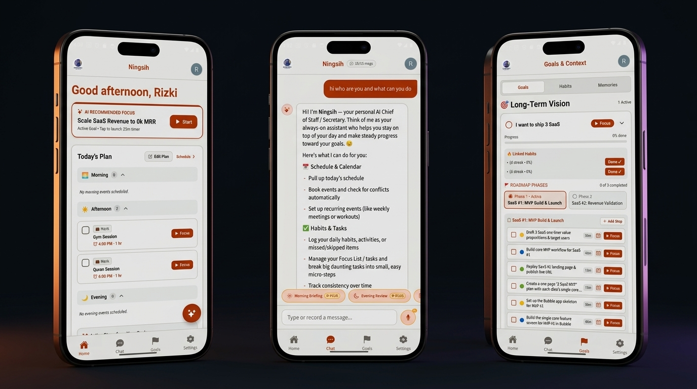
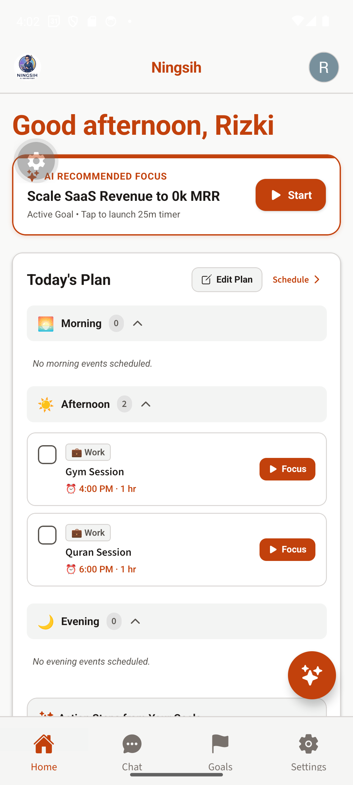
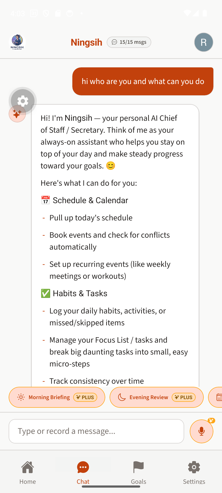
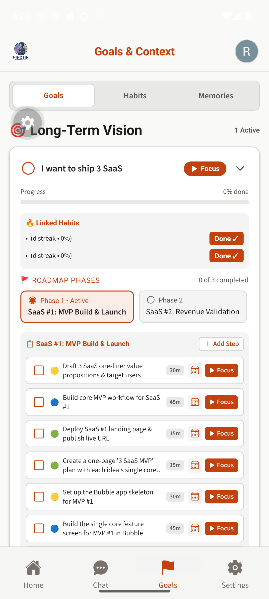
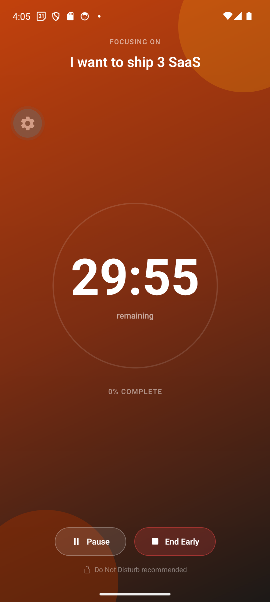
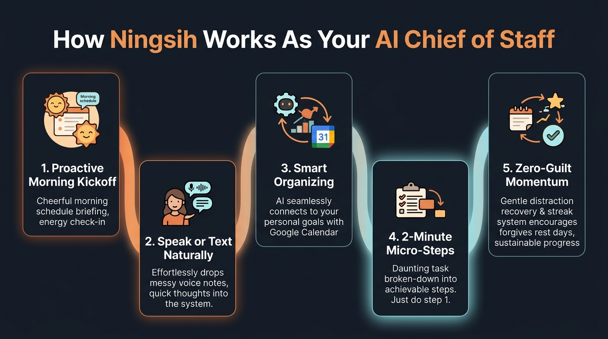
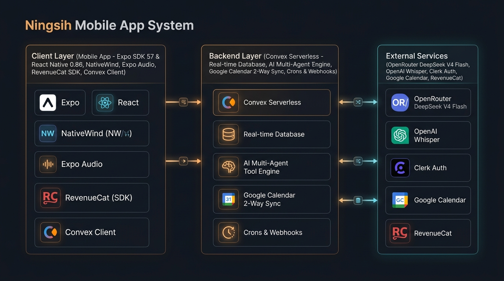

# Ningsih — AI Personal Chief of Staff

> An AI-powered personal chief of staff & productivity SaaS mobile application built for ambitious knowledge workers and ADHD minds to overcome executive dysfunction, time blindness, and calendar overload through natural conversation.



---

## 📱 App Experience & Screen Showcase

Real-world snapshots captured directly from the Android development build on the Pixel 6:

| 🌅 **Today's Dashboard** | 💬 **AI Chief of Staff** | 🌲 **Strategic Roadmap** | ⏱️ **Focus Session Timer** |
| :---: | :---: | :---: | :---: |
|  |  |  |  |
| *Day-part routines, AI recommended focus, and scheduled agenda* | *Conversational secretary with instant action cards & voice note input* | *3-tier goal cascade, roadmap phases, and actionable sprint tasks* | *ADHD-friendly focus countdown in warm ember dark-mode styling* |

---

## 🌟 Overview

**Ningsih** is a proactive, multi-tenant mobile SaaS application that turns natural language and voice input into structured daily momentum. Rather than forcing users into rigid project management boards, Ningsih acts as an intelligent digital chief of staff — managing Google Calendar, tracking habits and goals, generating 3-tier micro-task decompositions, recording long-term memories, facilitating Socratic goal alignment, providing distraction recovery check-ins, and orchestrating day-part routines, all via chat and voice.

---

## 🤝 How Ningsih Works As Your AI Chief of Staff

Ningsih is designed for real humans — especially busy professionals and ADHD minds struggling with executive dysfunction. Here is how your digital chief of staff assists you throughout the day:



### 1. 🌅 Proactive Morning Kickoff
You don’t have to remember to open the app and plan your day. Ningsih automatically prepares your morning briefing based on your chronotype (Early Bird vs. Night Owl) and checks your energy level before suggesting realistic focus blocks.

### 2. 🎙️ Speak or Text Naturally
No tedious forms or clicking through nested menus. Send messy voice notes or raw brain-dumps (e.g., *"I'm overwhelmed with this client proposal and need to fit in a gym session"*). Ningsih transcribes your voice instantly and extracts what needs to be done.

### 3. 🧠 Smart Organizing & Calendar Sync
Ningsih cross-references your request with your Google Calendar to find open slots, detects time conflicts before they happen, and links your daily actions to your overarching goals.

### 4. 🪜 2-Minute Micro-Steps (Breaking Task Paralysis)
When a task feels too big or intimidating, Ningsih breaks it into 3 difficulty tiers:
- 🟢 **Easy (~2 min):** A trivially simple initiation step to break inertia (e.g. *Open document & write title*).
- 🟡 **Medium (~3 min):** Light momentum step (e.g. *Outline 3 bullet points*).
- 🔵 **Larger (~5 min):** Focused progress step.
*Rule of thumb:* **"Just do step 1."**

### 5. 🛡️ Zero-Guilt Momentum & Distraction Recovery
If you lose focus or get sucked into social media, Ningsih offers gentle physical reset prompts (stretches, deep breaths) and 5-minute re-entry timers rather than shaming you. Streaks include rest-day tolerance buffers, so a single off-day never wipes out your progress.

---

## 🏗️ System Architecture Overview

Under the hood, Ningsih is built on a high-performance, serverless, real-time architecture connecting a React Native frontend to a Convex backend and AI orchestration engines:



### Key Architectural Layers

1. **Client Layer (Mobile App):**
   - **Framework:** Expo SDK 57 (React Native 0.86) with Expo Router (file-based navigation).
   - **Styling & Theme:** NativeWind v4 (Tailwind CSS v3) + Ember Studio Design System with dark-mode-first ember gradients and glassmorphism.
   - **Real-Time Data:** Reactive data binding via Convex React Native client (`useQuery`, `useMutation`, `useAction`).
   - **Native Hardware:** Voice note recording via `expo-audio`, haptic feedback via `expo-haptics`, and smart local alerts via `expo-notifications`.

2. **Backend Layer (Convex Serverless):**
   - **Real-Time Database:** Document store handling relational multi-tenant models (users, goals, milestones, tasks, activities, calendar events, memories, day-part routines).
   - **Deep Agent Engine (`convex/agent/`):** Unified tool execution registry with 10 native tools, structured tool parsing, Socratic goal alignment, and fallback resilience.
   - **Calendar Sync Engine (`convex/calendarSync.ts`):** 15-minute background cron sync, immediate on-write projection, conflict detection, and RRULE expansion.
   - **Server-Authoritative Entitlements:** Webhook verification and tier gating for Free vs. Plus/Premium capabilities.

3. **External Services & Integrations:**
   - **AI Intelligence:** OpenRouter powering DeepSeek V4 Flash (`~deepseek/deepseek-v4-flash-latest`) for low-latency reasoning and tool dispatch, with OpenAI API support as a fallback.
   - **Voice-to-Text:** OpenAI Whisper (`whisper-1`) for converting voice notes into structured tool calls.
   - **Identity & Auth:** Clerk Expo for Google OAuth authentication and secure token storage.
   - **In-App Purchases:** RevenueCat for Google Play / App Store subscription state and server webhook validation.

---

## ✨ Key Features

- 💬 **Core AI Agent Loop & Tool Calling:** Powered by **DeepSeek V4 Flash** via OpenRouter with real-time tool execution (`scheduleEvent`, `fetchTodaySchedule`, `logActivity`, `suggestMicroTask`, `alignGoal`, `manageGoal`, `manageTask`, `rememberContext`, `reportScreenTime`, `generateWeeklyReview`).
- 🌲 **Socratic Goal Alignment & Milestone Cascade:** Interactive 3-tier milestone breakdowns (Short/Long-term Goals → Sub-milestones → Sprint Tasks) with candidate quick-select chips to eliminate goal vagueness.
- 🎯 **Habit & Activity Consistency Engine:** 30-day rolling consistency score, per-activity streak calculation, rest-day tolerance buffers, and comeback celebrations.
- ⏱️ **Focus Sessions, Timer & Native Focus List:** Native focus timer, ambient sound, distraction recovery micro-steps, and native Focus List task management (`/tasks`).
- 🎙️ **Voice Note Input:** Native voice recording using `expo-audio` with automated transcription via OpenAI Whisper backend actions.
- 📅 **Google Calendar Integration & 2-Way Sync:** Unified schedule agenda, automatic time conflict detection, and recurring event support (RRULE) with tiered sync capabilities.
- 🧠 **ADHD & Executive Function Support:** 3-tier micro-task generator (🟢 2-min Easy, 🟡 3-min Medium, 🔵 5-min Larger) to break initiation inertia, distraction check-ins, and non-judgmental habit framing.
- 🌅 **Day-Part Routines & EOD Planning:** Structured Morning, Midday, Evening, and Night routines shaped by weekly rhythm themes and automated end-of-day plan proposals.
- 📊 **Weekly Insights & Native Charts:** Visual analytics powered by Gifted Charts displaying focus hours, habit consistency %, and AI-synthesized weekly progress reviews.
- 💎 **Freemium & Entitlement Gating:** Server-authoritative Free vs. Plus subscription tiers integrated with RevenueCat and in-app paywall modals.
- 🎨 **Ember Studio Design System:** Dark-mode-first aesthetic with ember gradients, glassmorphism, and custom typography (Playfair Display & Source Sans 3).

---

## 🛠️ Tech Stack

| Category | Technology |
|---|---|
| **Frontend Framework** | [Expo SDK 57](https://docs.expo.dev/versions/v57.0.0/) (React Native 0.86), [Expo Router](https://docs.expo.dev/router/introduction/) |
| **Styling & UI** | NativeWind (Tailwind CSS v3 for React Native), `expo-glass-effect`, `expo-linear-gradient` |
| **Backend & Database** | [Convex](https://www.convex.dev/) (Serverless real-time database, queries, mutations, Node.js actions) |
| **Authentication** | [Clerk Expo](https://clerk.com/docs/quickstarts/expo) (Google OAuth, SecureStore token persistence) |
| **Monetization & IAP** | [RevenueCat](https://www.revenuecat.com/) (`react-native-purchases` v10.7.0) |
| **AI Reasoning Engine** | OpenRouter / DeepSeek V4 Flash (`~deepseek/deepseek-v4-flash-latest`), OpenAI API (fallback) |
| **Voice Processing** | `expo-audio` (Native capture) + OpenAI Whisper (`whisper-1`) |
| **Charts & Visualization** | `react-native-gifted-charts`, `react-native-svg` |
| **Testing & Tooling** | `vitest` (Backend & unit tests), `agent-device` (Automated E2E replays), `rn-debug` MCP (Android inspection) |

---

## 🤖 AI Agent Tool Registry

The AI Agent leverages a deep module tool registry (`convex/agent/toolRegistry.ts`) with 10 co-located schemas and handlers:

| Tool | Purpose |
|---|---|
| `logActivity` | Logs habits, workouts, skips, or misses with pillar categorization and streak updates. |
| `fetchTodaySchedule` | Retrieves a unified schedule of Ningsih events, Google Calendar events, and completed activities. |
| `scheduleEvent` | Schedules calendar events with conflict checking, goal linking, and RRULE recurrence. |
| `alignGoal` | Initiates an interactive Socratic alignment session to break down ambiguous goals. |
| `manageGoal` | Creates, updates, pauses, or marks long/short-term goals as completed. |
| `manageTask` | Creates, lists, or marks tasks and micro-tasks as done in the native Focus List. |
| `suggestMicroTask` | Decomposes overwhelming tasks into 3 tiered micro-steps (2m / 3m / 5m) with "Just do step 1" framing. |
| `rememberContext` | Stores user constraints, preferences, and details into long-term vector memory. |
| `reportScreenTime` | Logs distraction time and generates immediate somatic reset and re-entry micro-actions. |
| `generateWeeklyReview` | Synthesizes weekly performance metrics, focus hours, and key wins into an insights review. |

---

## 🚀 Getting Started

### Prerequisites

- **Node.js** (v18+ recommended)
- **Android Studio & Android SDK** (with `Pixel_6` AVD configured)
- **Convex Account** (`npx convex dev`)
- **Clerk Account** (Publishable Key for Google OAuth)
- **RevenueCat Account** (API Key for Google Play / App Store)
- **OpenRouter / OpenAI Account** (API Keys for AI and voice transcription)

---

### 1. Installation

Clone the repository and install dependencies:

```bash
npm install
```

---

### 2. Environment Setup

Configure your environment across the client app and the Convex serverless backend:

#### A. Client Environment (`.env.local`)
Create a `.env.local` file in the root directory for Expo client variables:

```env
# Convex Backend URL
CONVEX_DEPLOYMENT=local:your-convex-deployment
EXPO_PUBLIC_CONVEX_URL=https://your-convex-deployment.convex.cloud
EXPO_PUBLIC_CONVEX_SITE_URL=http://127.0.0.1:3211

# Clerk Authentication
EXPO_PUBLIC_CLERK_PUBLISHABLE_KEY=pk_test_your_clerk_publishable_key

# RevenueCat In-App Purchases
EXPO_PUBLIC_REVENUECAT_API_KEY=goog_your_revenuecat_public_key

# Optional Error Monitoring
EXPO_PUBLIC_SENTRY_DSN=https://your_sentry_dsn
```

#### B. Convex Server Secrets
Set backend secrets directly in your Convex deployment using the CLI:

```bash
# AI Engine (OpenRouter / DeepSeek V4 Flash)
npx convex env set OPENROUTER_API_KEY "your_openrouter_api_key"
npx convex env set OPENROUTER_MODEL "~deepseek/deepseek-v4-flash-latest"

# Voice Transcription / Fallback AI
npx convex env set OPENAI_API_KEY "sk-your_openai_api_key"

# Authentication & Webhooks
npx convex env set CLERK_SECRET_KEY "sk_test_your_clerk_secret_key"
npx convex env set REVENUECAT_WEBHOOK_SECRET "whsec_your_revenuecat_webhook_secret"
```

---

## ⚡ Running Development Server

To launch the full local stack in a single automated command:

```bash
npm run dev:android
```

### What this command does automatically:
1. Checks and starts the **Convex backend server** on port `3210`.
2. Boots the **`Pixel_6` Android Emulator** if no device is active.
3. Configures **ADB reverse port forwarding** for ports `3210`, `3211` (Convex), and `8081` (Metro).
4. Starts the **Expo Metro development server** connected to the emulator.

> **Targeting Specific Devices:**
> - To target a connected physical phone directly: `npm run dev:device`
> - To target the Pixel 6 emulator directly: `npm run dev:emulator`

---

## 🧪 Seeding Synthetic Development Data

To populate your development environment with deterministic demo data (goals, activities, habits, calendar events):

1. Set your Clerk dev user ID in PowerShell:
   ```powershell
   $env:NINGSIH_FIXTURE_CLERK_ID = "user_your_clerk_user_id"
   ```
2. Enable dev fixtures in Convex:
   ```powershell
   npx.cmd convex env set NINGSIH_ENABLE_DEV_FIXTURES true
   ```
3. Run the seed script:
   ```bash
   npm run qa:seed
   ```

*(Note: Data is saved persistently in Convex, so you only need to run `qa:seed` once or when resetting test state).*

---

## 📜 Available NPM Scripts

| Command | Description |
|---|---|
| `npm run dev:android` | **Primary dev command:** Boots Convex backend, Android emulator, ADB port reverses, and Expo server. |
| `npm run dev:device` | Targets a connected physical Android device directly. |
| `npm run dev:emulator` | Targets the Pixel 6 Android emulator directly (booting AVD if stopped). |
| `npm run qa:seed` | Resets & seeds synthetic demo data for a development Clerk user. |
| `npm run test` | Runs unit & backend integration tests via Vitest. |
| `npm run smoke:android` | Executes automated headless E2E smoke tests via `agent-device`. |
| `npm run agent:doctor` | Verifies `agent-device` CLI setup and connected Android emulator health. |
| `npm run android` | Performs native prebuild & compiles Android `.apk` binary. |
| `npm run lint` | Runs Expo linter. |

---

## 📚 Documentation

For deeper details on design patterns, user flows, and architecture:

- [`docs/README.md`](docs/README.md) — Documentation hub (roles, audiences, reading order).
- [`docs/user-flow.md`](docs/user-flow.md) — User flow index; each flow lives in [`docs/user-flow/`](docs/user-flow).
- [`docs/roadmap.md`](docs/roadmap.md) — Implementation roadmap and current feature status.
- [`docs/revenuecat-setup.md`](docs/revenuecat-setup.md) — RevenueCat IAP setup and entitlement guide.
- [`docs/adr/`](docs/adr/) — Architecture Decision Records (ADRs 0001–0014).
- [`docs/agents/mobile-verification.md`](docs/agents/mobile-verification.md) — Runbook for `rn-debug` & `agent-device` mobile verification.
- [`AGENTS.md`](AGENTS.md) — Developer guidelines and workspace instructions.

---

## 📄 License

Private repository — All rights reserved.
